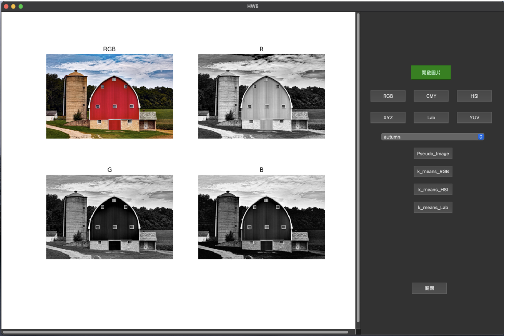
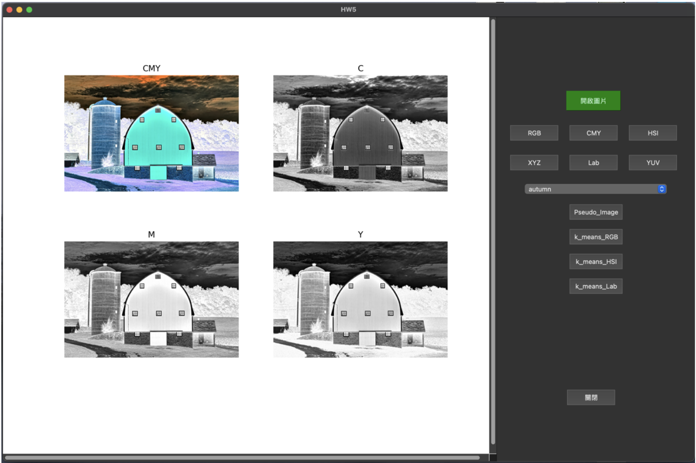
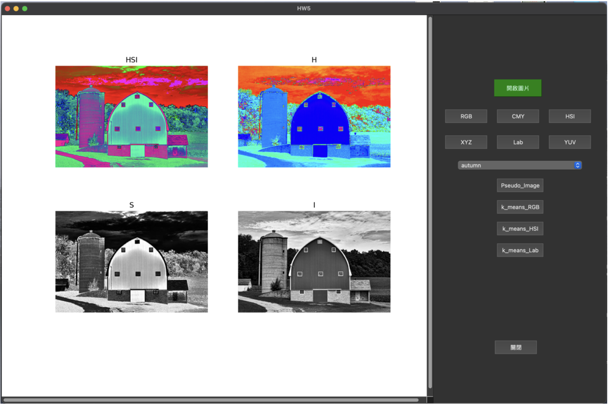
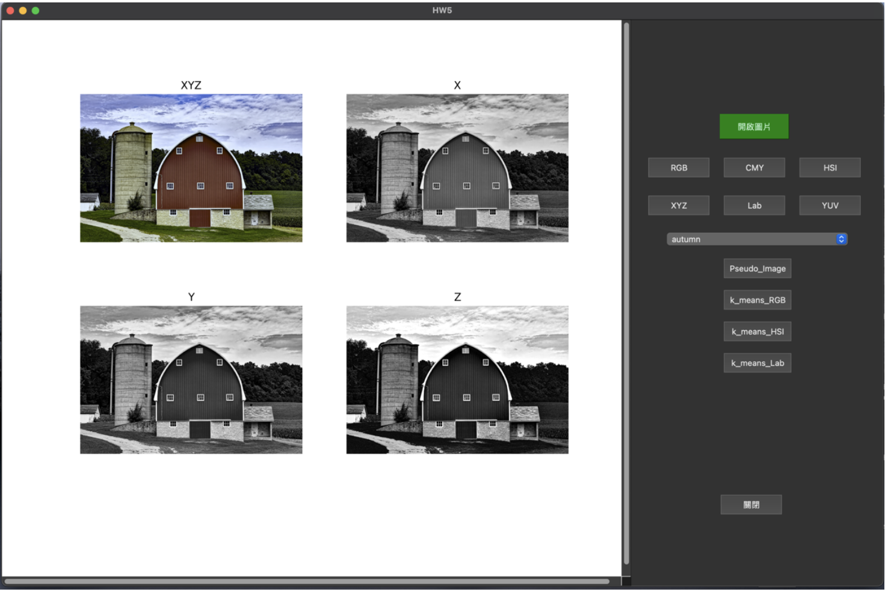
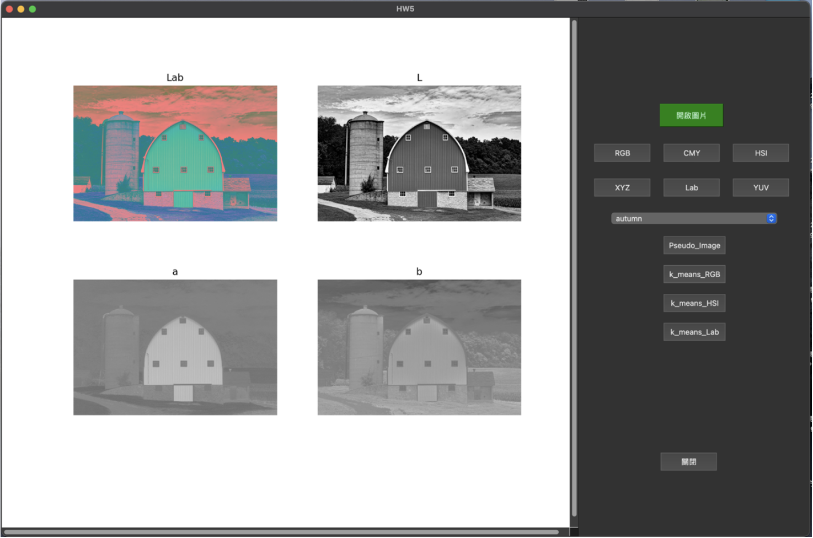
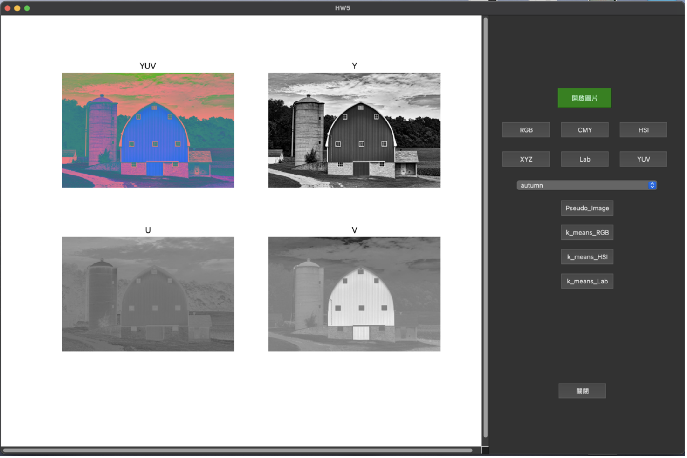
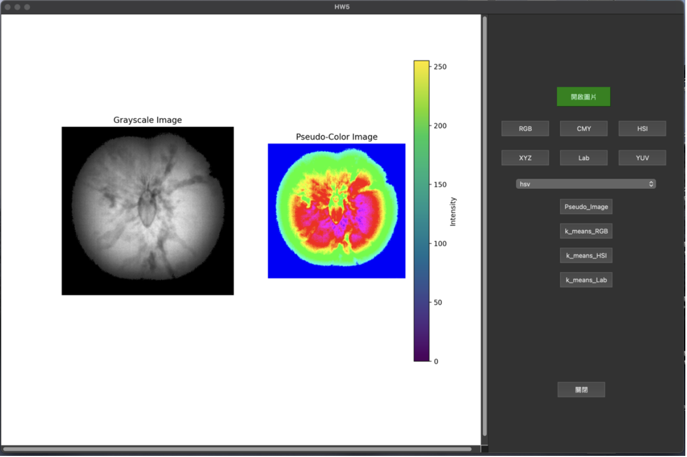
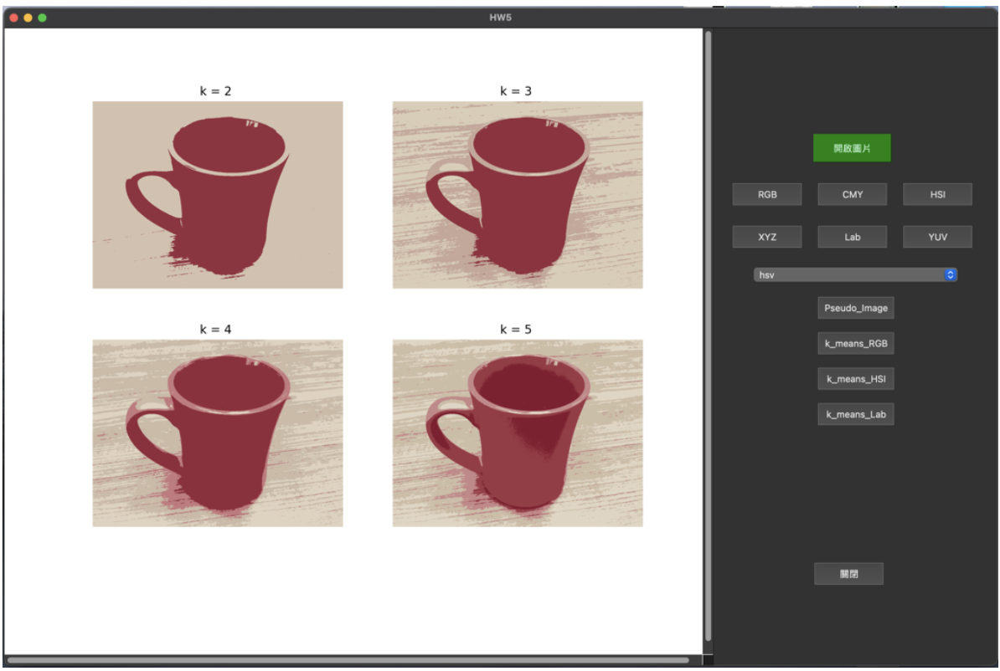
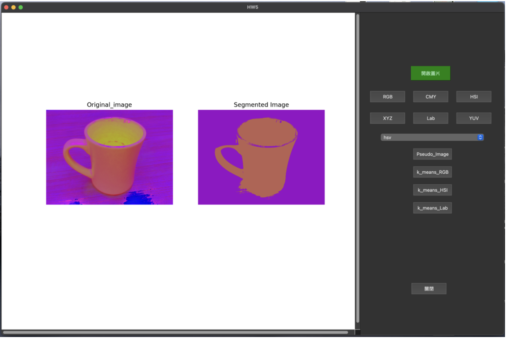
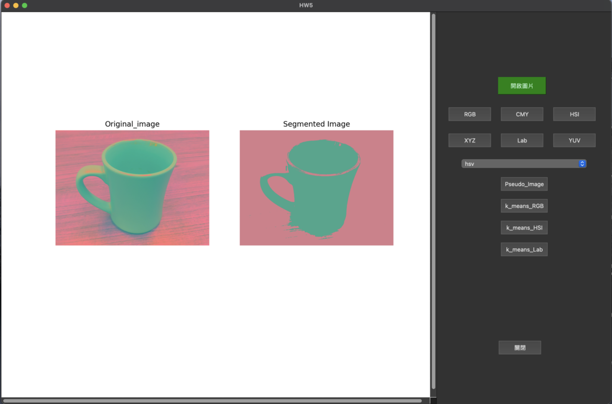

# PyQt5-Image-Processing-GUI-HW5

## 📌 HW5 - PyQt5 Image Processing GUI

This project is a graphical user interface (GUI) application for image processing, developed using **PyQt5**. It supports the following functions:

- Image loading and display  
- Color space conversion (RGB, CMY, HSI, XYZ, Lab, YUV)  
- Pseudo color mapping (Jet, Hot, Cool, Spring, etc.)  
- k-means clustering in different color spaces  

---

### 🖼 Features

#### 📁 Image Loading  
- Allows users to open and display an image from the local filesystem.

#### 🎨 Color Space Conversion  
- Supports conversion to and visualization of the following color spaces:
  - RGB
  - 
  - CMY
  - 
  - HSI
  - 
  - XYZ
  - 
  - Lab
  - 
  - YUV
  - 

#### 🌈 Pseudo Color Mapping  
- Applies OpenCV colormaps to grayscale images for pseudo color visualization:
  - Jet
  - Hot
  - Cool
  - Spring
  - 


#### 📊 k-means Clustering  
- Performs k-means clustering on image pixels in selected color spaces:
  - RGB
  - 
  - HSI
  - 
  - Lab
  - 
- Result is displayed as a segmented image based on clustering.

---

### 🛠 How to Run

1. **Install dependencies**  
   ```bash
   pip install opencv-python-headless PyQt5 numpy scikit-learn
   ```

2. **Run the GUI application**  
   ```bash
   python hw5_gui.py
   ```

---

### 📂 File Structure

```
│
├── hw5_gui.py              # Main GUI application
├── color_convert.py        # Color space conversion functions
├── colormap.py             # Pseudo color mapping logic
├── kmeans_clustering.py    # k-means clustering logic
└── README.md               # This documentation
```

---

### 🧑‍💻 Development Environment

- Python 3.8+
- PyQt5
- OpenCV 4.x
- NumPy
- scikit-learn

---
